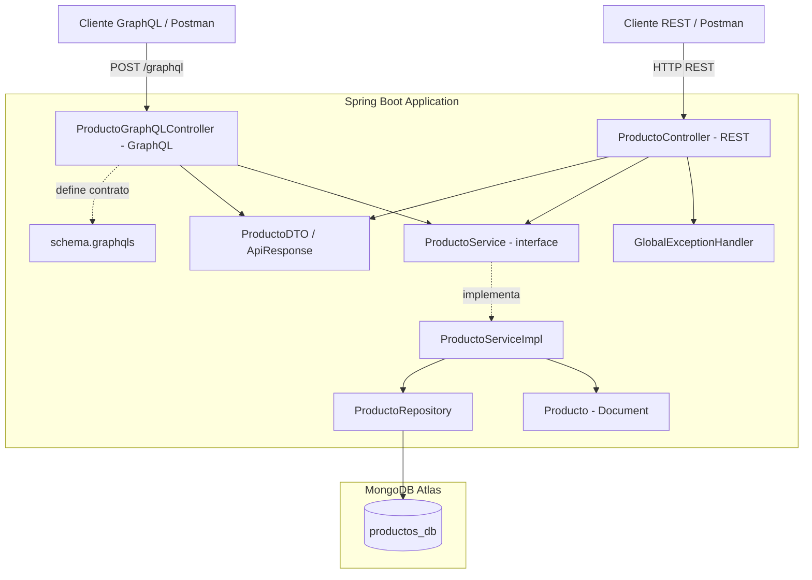
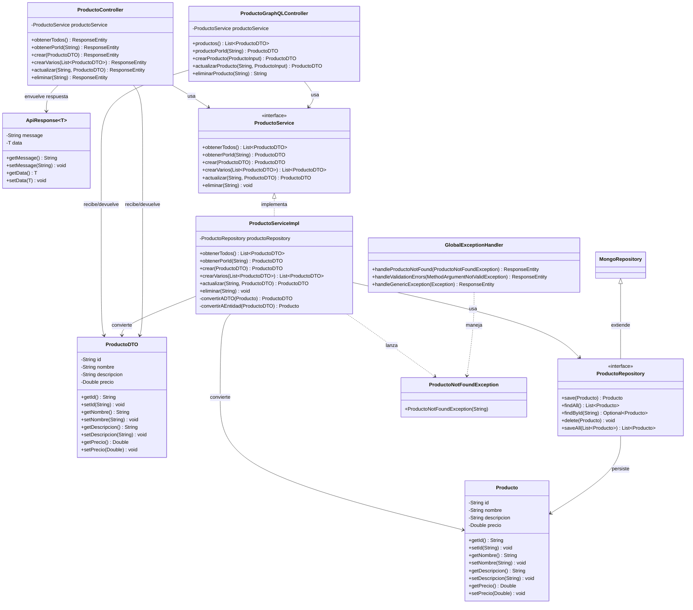

# Productos API - Spring Boot

API para la gestión de productos con operaciones CRUD, desarrollada con Spring Boot y MongoDB Atlas. Expone dos interfaces sobre la misma lógica de negocio: una **API REST** y una **API GraphQL**.

## Descripción

Aplicación backend que implementa servicios para crear, leer, actualizar y eliminar productos, expuestos vía REST y GraphQL. Utiliza Spring Data MongoDB como ODM (Object-Document Mapper) para la persistencia de datos en MongoDB Atlas (base de datos NoSQL en la nube) y Spring for GraphQL para las consultas declarativas.

## Tecnologías

- **Java 17** (LTS)
- **Spring Boot 3.2.5**
- **Spring Data MongoDB** (ODM - Object-Document Mapper)
- **Spring for GraphQL** (API GraphQL declarativa)
- **MongoDB Atlas** (Base de datos NoSQL en la nube)
- **Gradle 8.7** (Gestión de dependencias y build)
- **Jakarta Validation** (Validación de datos de entrada)

## Arquitectura

El proyecto implementa una **arquitectura en capas (Layered Architecture)** con inversión de dependencias:

```
┌─────────────────────────────────┐
│   Controller (Presentación)     │  ← Recibe peticiones HTTP
├─────────────────────────────────┤
│   DTO (Transferencia de datos)  │  ← Define qué ve el usuario
├─────────────────────────────────┤
│   Service (Lógica de negocio)   │  ← Reglas y operaciones CRUD
├─────────────────────────────────┤
│   Repository (Acceso a datos)   │  ← Comunicación con MongoDB
├─────────────────────────────────┤
│   Model (Entidad/Documento)     │  ← Estructura en la BD
└─────────────────────────────────┘
```

Cada capa tiene una responsabilidad única (SRP) y solo se comunica con la capa inmediatamente inferior. El controller depende de la interfaz del servicio, no de la implementación concreta (Principio de Inversión de Dependencias).

## Diagrama de Componentes

El proyecto expone dos interfaces sobre la misma capa de servicio: una API **REST** y una API **GraphQL**.



## Diagrama de Clases



## Estructura del Proyecto

```
src/main/
├── java/com/productos/api/
│   ├── ProductosApiApplication.java        # Clase principal (punto de entrada)
│   ├── model/
│   │   └── Producto.java                   # Entidad/Documento mapeado a MongoDB
│   ├── dto/
│   │   ├── ProductoDTO.java                # Objeto de transferencia de datos
│   │   └── ApiResponse.java                # Wrapper de respuesta con mensaje
│   ├── repository/
│   │   └── ProductoRepository.java         # Capa de acceso a datos (ODM)
│   ├── service/
│   │   ├── ProductoService.java            # Interfaz de lógica de negocio
│   │   └── ProductoServiceImpl.java        # Implementación de lógica de negocio
│   ├── controller/
│   │   ├── ProductoController.java         # Endpoints REST
│   │   └── ProductoGraphQLController.java  # Resolvers GraphQL (Query/Mutation)
│   └── exception/
│       ├── ProductoNotFoundException.java  # Excepción personalizada
│       └── GlobalExceptionHandler.java     # Manejo centralizado de errores
└── resources/
    ├── application.properties              # Configuración (MongoDB, GraphQL)
    └── graphql/
        └── schema.graphqls                 # Schema GraphQL (tipos, queries, mutations)
```

## Endpoints

| Método | Endpoint                  | Descripción                   | Response     |
|--------|--------------------------|-------------------------------|--------------|
| GET    | /api/productos           | Obtener todos los productos   | 200 OK       |
| GET    | /api/productos/{id}      | Obtener producto por ID       | 200 / 404    |
| POST   | /api/productos           | Crear nuevo producto          | 201 Created  |
| POST   | /api/productos/batch     | Crear múltiples productos     | 201 Created  |
| PUT    | /api/productos/{id}      | Actualizar producto existente | 200 / 404    |
| DELETE | /api/productos/{id}      | Eliminar producto             | 204 / 404    |

## Modelo de Datos - Producto

```json
{
  "id": "string (generado automáticamente por MongoDB)",
  "nombre": "string (obligatorio)",
  "descripcion": "string (obligatorio)",
  "precio": "number (obligatorio, mayor a 0)"
}
```

## Ejemplo de Request/Response

### POST /api/productos (Crear)

**Request:**
```json
{
  "nombre": "Laptop HP Pavilion",
  "descripcion": "Laptop HP Pavilion 15 pulgadas, 16GB RAM, 512GB SSD",
  "precio": 2500000
}
```

**Response (201 Created):**
```json
{
  "id": "66c1a2b3d4e5f6789012abcd",
  "nombre": "Laptop HP Pavilion",
  "descripcion": "Laptop HP Pavilion 15 pulgadas, 16GB RAM, 512GB SSD",
  "precio": 2500000
}
```

### Error de validación (400 Bad Request):
```json
{
  "timestamp": "2026-08-17T19:30:00",
  "status": 400,
  "error": "Bad Request",
  "message": "Error de validación en los campos enviados",
  "errors": {
    "nombre": "El nombre es obligatorio",
    "precio": "El precio debe ser mayor a cero"
  }
}
```

## Requisitos Previos

- Java 17 instalado
- Cuenta en MongoDB Atlas con cluster configurado

## Cómo Ejecutar

1. Clonar el repositorio:
```bash
git clone https://github.com/jairfeli2000-web/productos-api-springboot.git
cd productos-api-springboot
```

2. Ejecutar la aplicación:
```bash
./gradlew bootRun
```

3. La API estará disponible en: `http://localhost:8080/api/productos`

## Pruebas con Postman

Importar la colección de Postman ubicada en `postmanCollections/Productos-API.postman_collection.json` para probar todos los endpoints.

## API GraphQL

Además de la API REST, el proyecto expone una **API GraphQL** que permite consultar información de forma declarativa (el cliente pide exactamente los campos que necesita).

### Configuración

La integración usa la librería **Spring for GraphQL** (`spring-boot-starter-graphql`). El schema se define en `src/main/resources/graphql/schema.graphqls`.

- **Endpoint GraphQL:** `http://localhost:8080/graphql`
- **Interfaz GraphiQL (pruebas):** `http://localhost:8080/graphiql`

Se recomienda probar con **Postman** (importar `postmanCollections/Productos-GraphQL.postman_collection.json`). Usar un POST a `/graphql` con el Body en modo GraphQL, o con Body raw JSON:

```json
{ "query": "query { productos { id nombre precio } }" }
```

> Nota: La interfaz web GraphiQL (`/graphiql`) carga recursos desde el CDN externo `unpkg.com`. Si la red bloquea ese CDN (política CORS), GraphiQL no cargará; en ese caso, usar Postman, que consume el endpoint `/graphql` directamente sin dependencias externas.

### Operaciones disponibles

**Queries (consultas):**

```graphql
# Obtener todos los productos
query {
  productos {
    id
    nombre
    descripcion
    precio
  }
}

# Obtener un producto por ID
query {
  productoPorId(id: "66c1a2b3d4e5f6789012abcd") {
    nombre
    precio
  }
}
```

**Mutations (modificaciones):**

```graphql
# Crear un producto
mutation {
  crearProducto(input: {
    nombre: "Laptop HP Pavilion"
    descripcion: "Laptop 15 pulgadas, 16GB RAM"
    precio: 2500000
  }) {
    id
    nombre
  }
}

# Actualizar un producto
mutation {
  actualizarProducto(id: "66c1a2b3d4e5f6789012abcd", input: {
    nombre: "Laptop HP (Actualizada)"
    descripcion: "32GB RAM, 1TB SSD"
    precio: 3200000
  }) {
    id
    precio
  }
}

# Eliminar un producto
mutation {
  eliminarProducto(id: "66c1a2b3d4e5f6789012abcd")
}
```

### Ventaja de GraphQL sobre REST

Con GraphQL, el cliente pide solo los campos que necesita en una sola petición, evitando el over-fetching (traer datos de más) y el under-fetching (necesitar varias llamadas) típicos de REST.

## Materia

Arquitectura de Aplicaciones Web — Politécnico Grancolombiano

## Integrantes

- Jair Felipe Sánchez López
- Yeison Stiven Linares Guacaneme
- Jeison Stiven Ordoñez Moreno
