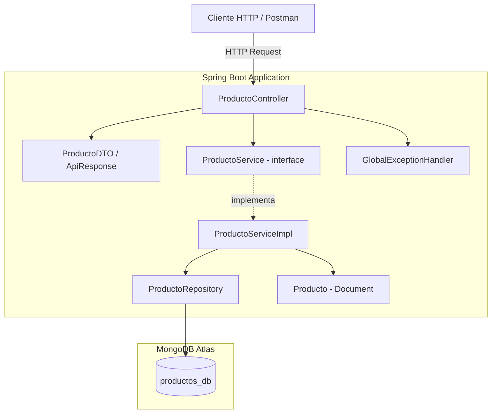
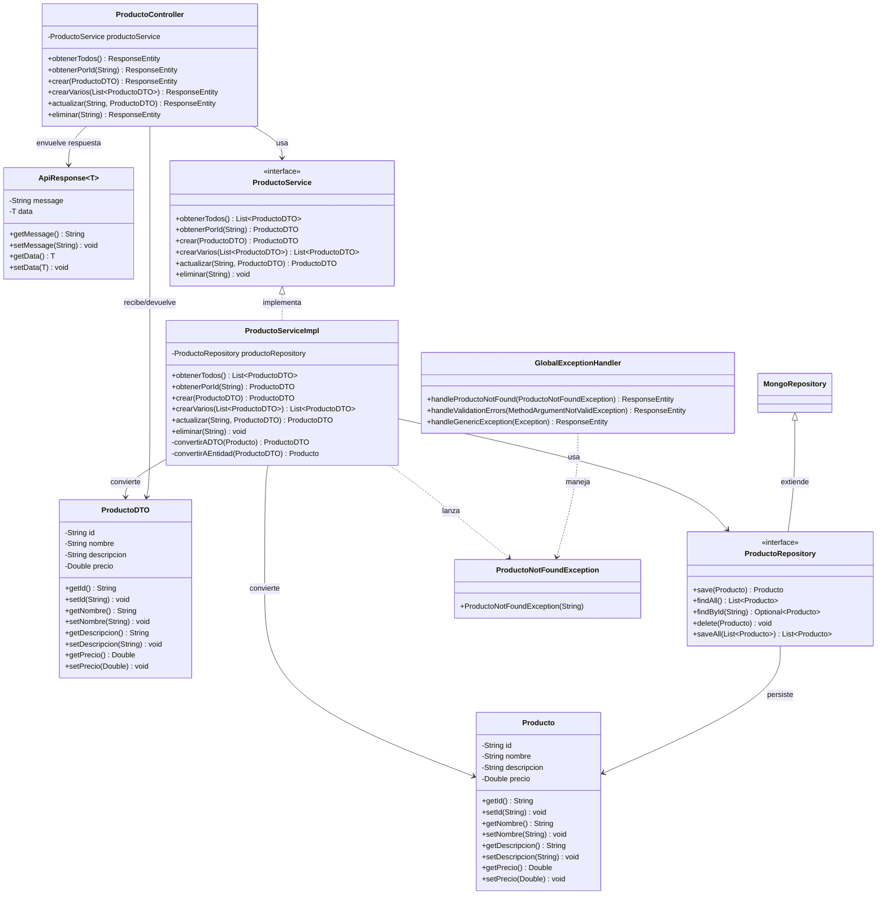

# Productos API - Spring Boot

API REST para la gestión de productos con operaciones CRUD, desarrollada con Spring Boot y MongoDB Atlas.

## Descripción

Aplicación backend que implementa servicios RESTful para crear, leer, actualizar y eliminar productos. Utiliza Spring Data MongoDB como ODM (Object-Document Mapper) para la persistencia de datos en MongoDB Atlas (base de datos NoSQL en la nube).

## Tecnologías

- **Java 17** (LTS)
- **Spring Boot 3.2.5**
- **Spring Data MongoDB** (ODM - Object-Document Mapper)
- **MongoDB Atlas** (Base de datos NoSQL en la nube)
- **Gradle 8.7** (Gestión de dependencias y build)
- **Jakarta Validation** (Validación de datos de entrada)

## Arquitectura

El proyecto implementa una **arquitectura en capas (Layered Architecture)** con inversión de dependencias:

```
┌─────────────────────────────────┐
│   Controller (Presentación)     │  ← Recibe peticiones HTTP
├─────────────────────────────────┤
│   DTO (Transferencia de datos)  │  ← Define qué ve el usuario
├─────────────────────────────────┤
│   Service (Lógica de negocio)   │  ← Reglas y operaciones CRUD
├─────────────────────────────────┤
│   Repository (Acceso a datos)   │  ← Comunicación con MongoDB
├─────────────────────────────────┤
│   Model (Entidad/Documento)     │  ← Estructura en la BD
└─────────────────────────────────┘
```

Cada capa tiene una responsabilidad única (SRP) y solo se comunica con la capa inmediatamente inferior. El controller depende de la interfaz del servicio, no de la implementación concreta (Principio de Inversión de Dependencias).

## Diagrama de Componentes



## Diagrama de Clases



## Estructura del Proyecto

```
src/main/java/com/productos/api/
├── ProductosApiApplication.java        # Clase principal (punto de entrada)
├── model/
│   └── Producto.java                   # Entidad/Documento mapeado a MongoDB
├── repository/
│   └── ProductoRepository.java         # Capa de acceso a datos (ODM)
├── service/
│   └── ProductoService.java            # Capa de lógica de negocio
├── controller/
│   └── ProductoController.java         # Capa de presentación (endpoints REST)
└── exception/
    ├── ProductoNotFoundException.java   # Excepción personalizada
    └── GlobalExceptionHandler.java     # Manejo centralizado de errores
```

## Endpoints

| Método | Endpoint                  | Descripción                   | Response     |
|--------|--------------------------|-------------------------------|--------------|
| GET    | /api/productos           | Obtener todos los productos   | 200 OK       |
| GET    | /api/productos/{id}      | Obtener producto por ID       | 200 / 404    |
| POST   | /api/productos           | Crear nuevo producto          | 201 Created  |
| POST   | /api/productos/batch     | Crear múltiples productos     | 201 Created  |
| PUT    | /api/productos/{id}      | Actualizar producto existente | 200 / 404    |
| DELETE | /api/productos/{id}      | Eliminar producto             | 204 / 404    |

## Modelo de Datos - Producto

```json
{
  "id": "string (generado automáticamente por MongoDB)",
  "nombre": "string (obligatorio)",
  "descripcion": "string (obligatorio)",
  "precio": "number (obligatorio, mayor a 0)"
}
```

## Ejemplo de Request/Response

### POST /api/productos (Crear)

**Request:**
```json
{
  "nombre": "Laptop HP Pavilion",
  "descripcion": "Laptop HP Pavilion 15 pulgadas, 16GB RAM, 512GB SSD",
  "precio": 2500000
}
```

**Response (201 Created):**
```json
{
  "id": "66c1a2b3d4e5f6789012abcd",
  "nombre": "Laptop HP Pavilion",
  "descripcion": "Laptop HP Pavilion 15 pulgadas, 16GB RAM, 512GB SSD",
  "precio": 2500000
}
```

### Error de validación (400 Bad Request):
```json
{
  "timestamp": "2026-08-17T19:30:00",
  "status": 400,
  "error": "Bad Request",
  "message": "Error de validación en los campos enviados",
  "errors": {
    "nombre": "El nombre es obligatorio",
    "precio": "El precio debe ser mayor a cero"
  }
}
```

## Requisitos Previos

- Java 17 instalado
- Cuenta en MongoDB Atlas con cluster configurado

## Cómo Ejecutar

1. Clonar el repositorio:
```bash
git clone https://github.com/jairfeli2000-web/productos-api-springboot.git
cd productos-api-springboot
```

2. Ejecutar la aplicación:
```bash
./gradlew bootRun
```

3. La API estará disponible en: `http://localhost:8080/api/productos`

## Pruebas con Postman

Importar la colección de Postman ubicada en `postmanCollections/Productos-API.postman_collection.json` para probar todos los endpoints.

## Autor

Jair Felipe Sánchez López
